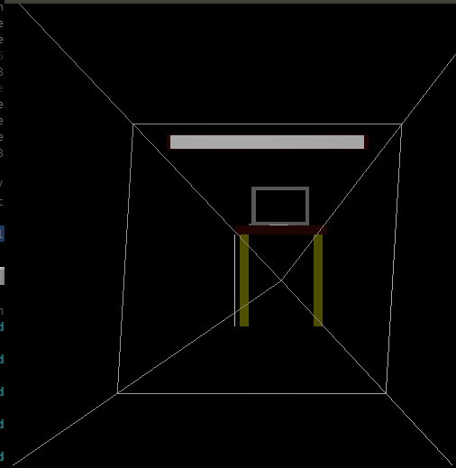
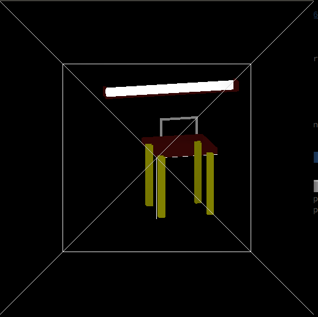
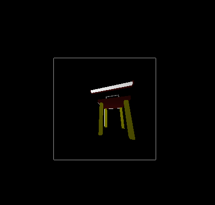

# CS475 Assignment 2
-----
#### Alankar Kotwal (12D070010), Manish Goregaokar (120260006)  

##### Running the program
To compile the code unzip the submission, go to the un-zipped folder and type 
```sh
$ make
```
This should generate an executable called `model` in the folder. To run the executable type
```sh
$ ./model
```

This will load the scene file in `scenes/myscene.scn`

By default, the program will show the scene in the world coordinate system,
with coordinate axes and the frustrum.

By hitting 1, you can shift to the view coordinate system. CCS/NDCS can be
obtained from 2 and 3 (they are visually the same). DCS can be obtained from 4.
Once can revert to WCS with `1`

The [inspection controls from Assignment 1](http://alankarkotwal.github.io/cs475_1/)
are still available. These will manipulate the displayed object in OpenGL's coordinate
system, not the world coordinate system. These help one inspect how perspective
is actually acheived.


Sample pictures:

In WCS:



In VCS:



In CCS/NDCS/DCS (for a square viewport):

