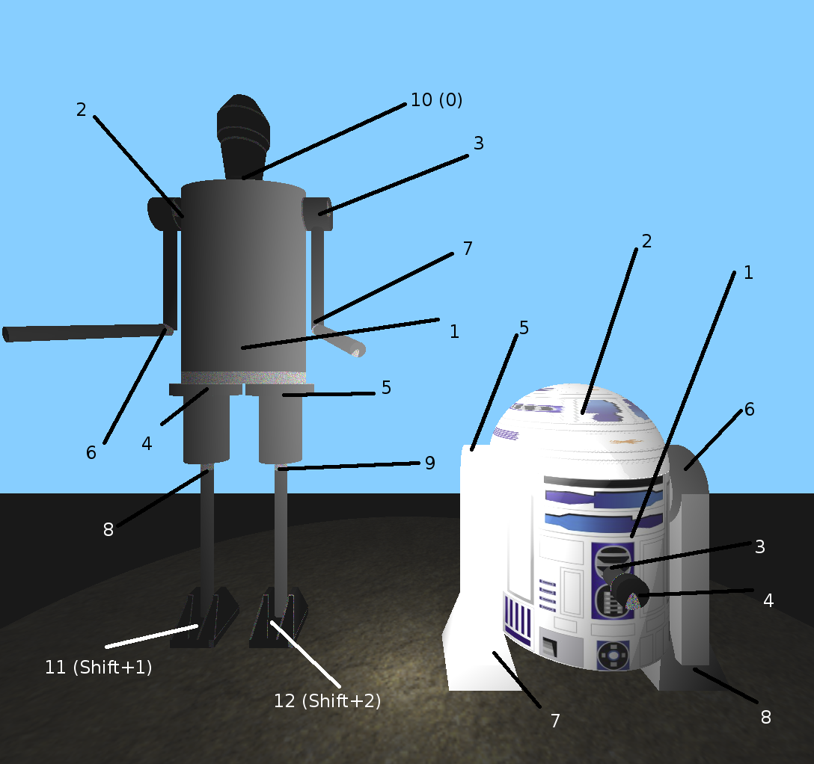

# CS475 Assignment 4
-----
#### Alankar Kotwal (12D070010), Manish Goregaokar (120260006)  

##### Running the program
To compile the code unzip the submission, go to the un-zipped folder and type 
```sh
$ make
```
This should generate an executable called `mail` in the folder. To run the executable type
```sh
$ ./main
```

To run an animation, use

```sh
$ ./main animate
```

or 

```sh
$ ./main animate keyframes.txt
```

##### Creating an animation

Use the controls in the creation mode (see below) to pose your figure, and hit Ctrl-S to save. It will ask you for a number (this is for easily ordering the frame files) and save as `frames/frame-NNN.txt`.

The keyframe files have a format 

```text
0 frames/frame-0000.txt 0
1 frames/frame-0001.txt 0
2 frames/frame-0002.txt 0
```

The first number is the absolute time, the second string is the frame number. With the third digit we can specify the number of frames for which the camera should take a bezier curve, i.e. here:

```text
0 frames/frame-0101.txt 0
1 frames/frame-0101.txt 3
2 frames/frame-0102.txt 0
3 frames/frame-0103.txt 0
4 frames/frame-0104.txt 0
```

the camera will interpolate a bezier curve through control points 1,2,3,4.

You can pick a keyframe file to run with `./main animate name_of_file.txt`. By default `keyframes.txt` is run

##### Controls (Creation mode)

The following positional controls modify the position/orientation of the "selected" segment:

  - `Up`/`Down`: Rotate along `X`
  - `Left`/`Right`: Rotate along `Y`
  - `<`/`>` (actually, `,`/`.`, do not hold shift key): Rotate along `Z`
  - `I`/`K`: Translate along `X`
  - `J`/`L`: Translate along `Y`
  - `U`/`O`: Translate along `Z`

You can switch between the current model using the `M` key. By default, IG-88 is selected.

Using the number keys you can  select a segment to pose.

The segments are labeled below, along with their degrees of freedom. Note that these degrees of freedom correspond to the keys from the positional controls which may be used; not the actual direction in which the segment may rotate.



IG-88:

 1. Whole model (Freely movable)
 2. Left shoulder (Rotation around X)
 3. Right shoulder (Rotation around X)
 4. Left hip (Rotation around Y)
 5. Right hip (Rotation around Y)
 6. Left elbow (Free rotation)
 7. Right elbow (Free rotation)
 8. Left knee (Free rotation)
 9. Right knee (Free rotation)
 10. Head (Rotation around X, Y) [Selected with key `0`]
 11. Left ankle (Rotation around X) [Selected with `Shift`+`1`]
 12. Right ankle (Rotation around X) [Selected with `Shift`+`2`]
 13. 
 
R2-D2:

 1. Whole model (Freely movable)
 2. Head (Rotation around Y)
 3. Probe arm (Translation around Z)
 4. Probe tip (Rotation around Z)
 5. Left "leg" (Rotation around X)
 6. Right "leg" (Rotation around X)
 7. Left foot (Rotation around X)
 8. Right foot (Rotation around X)
 
The camera can be manipulated using the positional controls with the `Shift` key, i.e. `Shift`+`Left` will rotate the camera around Y and `Shift`+`I` will move it along X.

The lights can be similarly manipulated. We have three lights:

 - Light 1 (directionless) can be manipulated with the translation controls with `Ctrl` pressed. It can be toggled with `Ctrl`+`V`
 - Light 2 (directionless) can be manipulated with the translation controls with `Alt` pressed. It can be toggled with `Alt`+`V`
 - The spotlight can be manipulated with all positional controls with `Ctrl` and `Alt` both pressed. I.e. `Ctrl`+`Alt`+`I` will move the spotlight forward along X. It can be toggled with `Ctrl`+`Alt`+`V`
 
Finally, the WASD/QE keys let you "look around" at the current camera. This will not change the "forward" direction of the camera used when moving unlike `Shift`+(arrow keys); it just changes the viewpoint (as if you have turned your neck).


